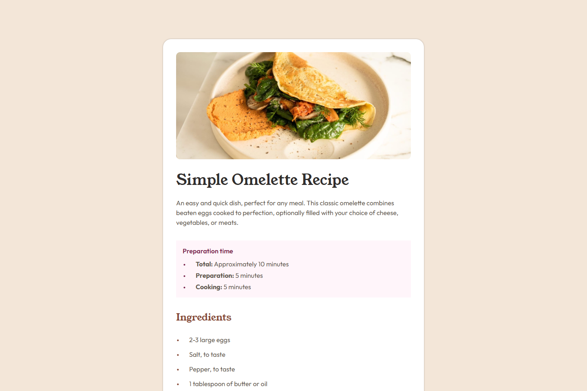

# 💻 Simple Omelette Recipe

## ℹ️ A Recipe Page Challenge Built with HTML and CSS

| _Mobile Preview (375x812)_                       | _Desktop Preview (1440x960)_                        |
| ------------------------------------------------ | --------------------------------------------------- |
|  |  |

This project is a static recipe webpage built from a given design and style guide. It showcases a clean, responsive layout using semantic HTML and modular CSS, styled to highlight readability, structure, and accessibility. Created as part of the building challenges from [Frontend Mentor](https://www.frontendmentor.io/).

---

## 🔍 Overview

This simple, mobile-friendly website presents a recipe for making a classic omelette which was made from real-world designs and style guides for practice, making it an excellent exercise in pixel-perfect implementation, CSS responsiveness, and accessibility.

It is structured with semantic HTML elements and scalable CSS, suitable for learners practicing real layout replication without JavaScript.

---

## ✨ Features

- Hero image with descriptive title and summary paragraph
- Prep time section styled as a visually distinct aside
- Clear ingredient list and instruction steps
- Nutritional information in table format
- Responsive layout for mobile and desktop screens
- Semantic HTML for screen readers
- BEM-style class naming for scalable CSS

---

## 🧠 What I Learned

- How to convert a design image and style guide into working HTML and CSS
- The importance of semantic HTML for screen readers and SEO
- Applying responsive design with media queries and fluid units
- Managing design tokens using CSS custom properties (variables)
- Structuring layouts using utility-first and BEM-inspired class systems
- Enhancing accessibility with elements like `<aside>`, `<section>`, and `<table>`

---

## 🛠️ Tech Used

- HTML5
- CSS3
- Git
- GitHub
- Netlify

---

## 🚀 How to Run

1. Clone the repository
2. Open `index.html` in your browser

---

## 🌐 Live Demo

Or you can check out the 👉 [live website here](https://simple-omelette-recipe-fm-jiro.netlify.app/)

---

## 🧑‍💻 Author

Created by **Elmar Chavez**

🗓️ Month/Year: **June 2025**

📚 Journey: **3rd** month of learning _frontend web development_.
